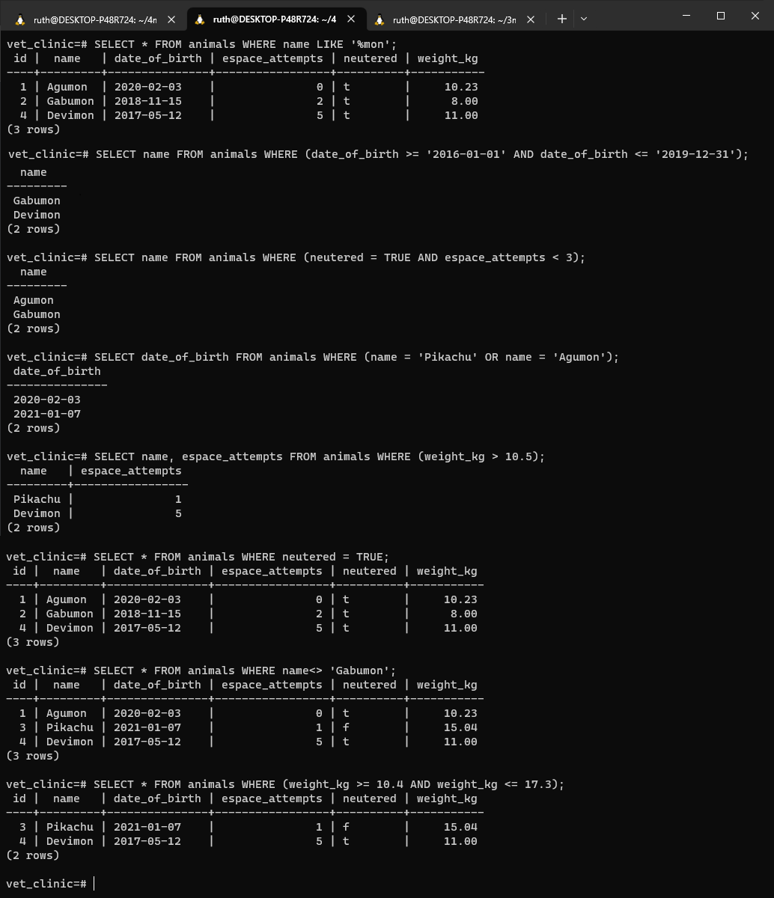

<a name="readme-top"></a>

<div align="center">
  <h1><b>Vet Clinic | `SQL` `PostgreSQL`</b></h1>
</div>

---

<!-- TABLE OF CONTENTS -->

# 📗 Table of Contents

- [� Table of Contents](#-table-of-contents)
- [📖 Vet Clinic ](#-vet-clinic-)
  - [🛠 Built With ](#-built-with-)
    - [Tech Stack ](#tech-stack-)
    - [Key Features ](#key-features-)
  - [🚀 SQL Queries preview ](#-sql-queries-preview-)
  - [💻 Getting Started ](#-getting-started-)
    - [Prerequisites](#prerequisites)
    - [Setup](#setup)
    - [Install](#install)
  - [👥 Authors ](#-authors-)
  - [🔭 Future Features ](#-future-features-)
  - [🤝 Contributing ](#-contributing-)
  - [⭐️ Show your support ](#️-show-your-support-)
  - [🙏 Acknowledgments ](#-acknowledgments-)
  - [📝 License ](#-license-)

---

<!-- PROJECT DESCRIPTION -->

# 📖 Vet Clinic <a name="about-project"></a>

**Vet Clinic** repository includes files with plain SQL that can be used to recreate a database:

- Use [schema.sql](./schema.sql) to create all tables.
- Use [data.sql](./data.sql) to populate tables with sample data.
- Check [queries.sql](./queries.sql) for examples of queries that can be run on a newly created database. **Important note: this file might include queries that make changes in the database (e.g., remove records). Use them responsibly!**


## 🛠 Built With <a name="built-with"></a>

### Tech Stack <a name="tech-stack"></a>

<details>
  <summary>Client</summary>
  <ul>
    <li><a href="https://www.postgresql.org/">PostgreSQL</a></li>
  </ul>
</details>

<details>
<summary>Database</summary>
  <ul>
    <li><a href="https://www.w3schools.com/sql/">SQL</a></li>
  </ul>
</details>

---

<!-- Features -->

### Key Features <a name="key-features"></a>

- **[Storage data in the Database]** It correctly storage the data on the database and can be interacted using SQL commands.

<p align="right">(<a href="#readme-top">back to top</a>)</p>

---

<!-- LIVE DEMO -->

## 🚀 SQL Queries preview <a name="live-demo"></a>



<p align="right">(<a href="#readme-top">back to top</a>)</p>

---

<!-- GETTING STARTED -->

## 💻 Getting Started <a name="getting-started"></a>


To get a local copy up and running, follow these steps.

### Prerequisites

In order to run this project you need:

<ul>
    <li><p>A modern browser (supports html5)</p></li>
</ul>

### Setup

Clone this repository to your desired folder by using this 👇️ command :

```
git clone https://github.com/Ruthmy/vet-clinic-db.git
```

### Install

Install this project with:

```
 instalation is not required
```

<p align="right">(<a href="#readme-top">back to top</a>)</p>

---

<!-- AUTHORS -->

## 👥 Authors <a name="authors"></a>

👤 **Ruth Abreu**

- GitHub: [@Ruthmy](https://github.com/Ruthmy)
- Twitter: [@rury_exe](https://twitter.com/rury_exe)
- LinkedIn: [LinkedIn](https://linkedin.com/in/ruth-abreu)

👤 **Nitcelis Bravo**

- GitHub: [Nitcelis Bravo](https://github.com/NitBravoA92)
- Twitter: [@softwareDevOne](https://twitter.com/softwareDevOne)
- LinkedIn: [Nitcelis Bravo Alcala](https://www.linkedin.com/in/nitcelis-bravo-alcala-b65340158)

<p align="right">(<a href="#readme-top">back to top</a>)</p>

---

<!-- FUTURE FEATURES -->

## 🔭 Future Features <a name="future-features"></a>

- [ ] **[Add more query to manage the database]** With this implementation I'll be able to have a better management of the data.
- [ ] **[Integrate Back-End]** With the integration of a back-end part to this project, the data will be able to be managed and modified.

<p align="right">(<a href="#readme-top">back to top</a>)</p>

---

<!-- CONTRIBUTING -->

## 🤝 Contributing <a name="contributing"></a>

Contributions, issues, and feature requests are welcome!

Feel free to check the [issues page](https://github.com/Ruthmy/vet-clinic-db/issues).

<p align="right">(<a href="#readme-top">back to top</a>)</p>

---

<!-- SUPPORT -->

## ⭐️ Show your support <a name="support"></a>

If you like this project and know someone who might find it helpful, please share it.
Or give it a **star** ⭐️

<p align="right">(<a href="#readme-top">back to top</a>)</p>

---

<!-- ACKNOWLEDGEMENTS -->

## 🙏 Acknowledgments <a name="acknowledgements"></a>

I thank Microverse for this fantastic opportunity, and the code reviewers for their advice and time.

<p align="right">(<a href="#readme-top">back to top</a>)</p>

---

<!-- LICENSE -->

## 📝 License <a name="license"></a>

This project is [MIT](./LICENSE) licensed.

<p align="right">(<a href="#readme-top">back to top</a>)</p>

---
